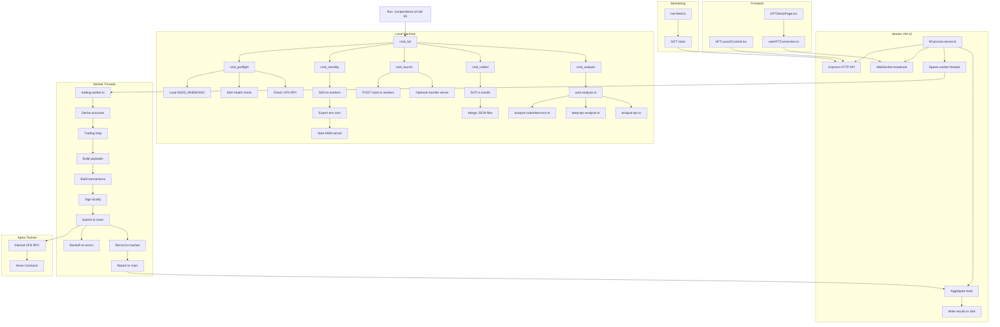

# Polymarket on Aptos

A fully functional prediction market platform demonstrating Polymarket-style trading on Aptos blockchain. Features sub-second finality, parallel transaction execution, and real-time HFT bot visualization.

**Target:** 30,000+ TPS with distributed workers

---

## 🚀 Demo Quick Start

### Recommended Workflow (Standby Mode)

```bash
# Step 1: Deploy latest code to all workers
./scripts/orchestrator.sh deploy

# Step 2: Start all workers in STANDBY mode (no auto-trading)
./scripts/orchestrator.sh standby

# Step 3: Start frontend
npm run dev

# Step 4: Open browser → ARM → LAUNCH
# http://localhost:5173/demo-day
```

### Demo Modes

| Mode | Command | TPS | Duration | Use Case |
|------|---------|-----|----------|----------|
| **Standby** | `./scripts/orchestrator.sh standby` | - | - | Wait for UI launch (recommended) |
| **Dry Run** | `./scripts/orchestrator.sh dryrun` | ~100 | 5 sec | Quick test |
| **Full Demo** | `./scripts/orchestrator.sh demo` | ~30K | 60 sec | Auto-start demo |

**Pre-flight check:** Run `./scripts/pre-demo-checklist.sh` before the demo!

---

### 🧪 Dry Run (Quick Test)

Perfect for testing the full UI flow without burning APT.

```bash
# Terminal 1: Start dry run server
./scripts/orchestrator.sh dryrun

# Terminal 2: Watch the logs
./scripts/dryrun-view.sh

# Terminal 3: Start frontend
npm run dev
```

Then in your browser:
1. Go to http://localhost:5173/polymarket
2. Click **"Start Demo"** → TPS Dashboard
3. Click **ARM SYSTEM** → Pre-flight checks
4. Click **LAUNCH DEMO** → 3... 2... 1...
5. Watch ~10 TPS for 5 seconds (minimal APT usage)

---

### ⚡ Full 30K TPS Demo

The real deal. 25 accounts across 3 cloud VMs.

```bash
# Terminal 1: Start all workers
./scripts/orchestrator.sh demo

# Terminal 2: Sexy 3-pane log viewer
./scripts/demo-view.sh

# Terminal 3: Start frontend
npm run dev
```

Then in your browser:
1. Go to http://localhost:5173/polymarket
2. Click **"Start Demo"** → TPS Dashboard
3. Click **ARM SYSTEM** → Pre-flight checks pass ✓
4. Click **LAUNCH DEMO** → 3... 2... 1... 🚀
5. Watch 30K+ TPS with whale trades making the chart spike!

---

### 📊 Log Viewer Preview

The demo viewers show beautiful real-time logs:

```
12:34:56.789 0x1bd17a ✓148/150 1523 TPS 12ms 99%
12:34:56.891 0xe1da81 🚀150 ~1650 TPS 91ms
12:34:56.995 0x2acdcd ✓147/150 1489 TPS 11ms 98%

                    ⚡ HFT STATS ⚡
────────────────────────────────────────────────────────
  TPS: 28,450  Peak: 31,200  Avg: 27,890
  Trades: 1,245,000  Success: 99.2%  Latency: 12ms
  Elapsed: 45s  Accounts: 9/9  Clients: 1
  Prices: Vance: 18%  Rubio: 15%  Trump: 42%  DeSantis: 12%
────────────────────────────────────────────────────────
```

---

### 🛠️ Orchestrator Commands

```bash
./scripts/orchestrator.sh status   # Check all infrastructure
./scripts/orchestrator.sh dryrun   # Quick 100 TPS test (5 sec)
./scripts/orchestrator.sh demo     # Full 30K TPS demo (60 sec)
./scripts/orchestrator.sh demo 30  # Custom duration (30 sec)
./scripts/orchestrator.sh stop     # Stop all workers
```

---

## Infrastructure

### Cloud Workers (3 VMs)

| Worker | IP | Accounts | APT Balance | Est. TPS |
|--------|-----|----------|-------------|----------|
| Worker 1 | 178.128.177.88 | 9 | ~12,660 APT | ~13K |
| Worker 2 | 147.182.237.239 | 8 | ~18,800 APT | ~12K |
| Worker 3 | 161.35.231.0 | 8 | ~89,600 APT | ~12K |
| **Total** | | **25** | **~121,000 APT** | **~37K** |

### Account Audit Summary

Run `npx tsx scripts/audit-accounts.ts` for full breakdown.

| Category | Count | Balance |
|----------|-------|---------|
| Trading Accounts (in orchestrator) | 25 | 121,068 APT |
| Contract Account | 1 | 749 APT |
| Other Accounts | 13 | ~0 APT |
| **Total Available** | | **~122,000 APT** |

### Fullnode & RPC

| Component | IP/URL | Purpose |
|-----------|--------|---------|
| Aptos Fullnode | aptos.cash.trading:8080 | Low-latency RPC (unlimited) |
| QuickNode | polished-evocative-borough... | Primary RPC (50 RPS) |
| Aptos Labs | fullnode.testnet.aptoslabs.com | Fallback RPC |

---

## TPS Modes

The HFT server supports 5 modes with escalating TPS targets:

| Mode | Command | Target TPS | Batch | Delay | Use Case |
|------|---------|-----------|-------|-------|----------|
| `dryrun` | `npx tsx server/hft-ultra-server.ts dryrun 30` | ~10 | 1 | 100ms | UI testing |
| `normal` | `npx tsx server/hft-ultra-server.ts normal 60` | ~1,000 | 10 | 50ms | Light demo |
| `turbo` | `npx tsx server/hft-ultra-server.ts turbo 60` | ~3,000 | 30 | 40ms | Medium |
| `ultra` | `npx tsx server/hft-ultra-server.ts ultra 60` | ~10,000 | 80 | 30ms | High intensity |
| `quantum` | `npx tsx server/hft-ultra-server.ts quantum 60` | ~30,000+ | 150 | 20ms | **DEMO DAY** |

The orchestrator uses **quantum mode** for `./scripts/orchestrator.sh demo`.

---

## TPS Demo Architecture

```
┌─────────────────────────────────────────────────────────────────────────┐
│                           YOUR LAPTOP                                    │
│  ┌──────────────────┐                                                   │
│  │ React Frontend   │◄──── WebSocket ────┐                              │
│  │ - Market UI      │                    │                              │
│  │ - TPS Dashboard  │                    │                              │
│  │ - Trade Stream   │                    │                              │
│  └──────────────────┘                    │                              │
└──────────────────────────────────────────┼──────────────────────────────┘
                                           │
     ┌─────────────────────────────────────┼─────────────────────────────┐
     │                          CLOUD VMs                                 │
     │                                                                    │
     │   ┌─────────────────┐  ┌─────────────────┐  ┌─────────────────┐   │
     │   │   Worker 1      │  │   Worker 2      │  │   Worker 3      │   │
     │   │ 178.128.177.88  │  │ 147.182.237.239 │  │ 161.35.231.0    │   │
     │   │ 9 accounts      │  │ 8 accounts      │  │ 8 accounts      │   │
     │   │ ~13K TPS        │  │ ~12K TPS        │  │ ~12K TPS        │   │
     │   └────────┬────────┘  └────────┬────────┘  └────────┬────────┘   │
     │            │                    │                    │            │
     └────────────┼────────────────────┼────────────────────┼────────────┘
                  │                    │                    │
                  └────────────────────┼────────────────────┘
                                       │
                                       ▼
                     ┌─────────────────────────────────┐
                     │    YOUR FULLNODE (Optional)     │
                     │    aptos.cash.trading:8080           │
                     │    Low latency, no rate limits  │
                     └─────────────────┬───────────────┘
                                       │
                                       ▼
                     ┌─────────────────────────────────┐
                     │         APTOS TESTNET           │
                     │  Multi-outcome prediction       │
                     │  market with Aggregator V2      │
                     │  ~160K TPS network capacity     │
                     └─────────────────────────────────┘
```

---

## Demo Script Flow (Max TPS)

For the highest TPS using the 2000-account demo script, run AMM-only full mode:

```bash
./scripts/demo.sh full 60
```

Mermaid flow of how `scripts/demo.sh` ties into the codebase and the execution path:



Notes:
- `--dual` splits accounts between AMM and USD1 transfers; AMM-only maximizes TPS.
- `cmd_deploy` syncs `server/` to `/opt/aptos-hft` on each worker if you changed server code.

## Trade Size Distribution (Full Demo)

To create visual impact (chart spikes) while conserving APT:

| Chance | Size | Effect |
|--------|------|--------|
| 0.1% | 8-15 APT | 🐳 MEGA WHALE - massive spike! |
| 0.5% | 2-6 APT | 🐋 Whale - big jump |
| 2% | 0.3-1 APT | Large - noticeable |
| 5% | 0.1-0.3 APT | Medium |
| 15% | 0.03-0.1 APT | Small |
| 77.4% | 0.005-0.03 APT | Micro |

**Trump emerges as frontrunner** (~40-50%) through weighted trading strategy.

---

## Key Addresses (Testnet)

| Type | Address |
|------|---------|
| **Contract (v3 - Full Aggregators)** | `0xa2e5e47aab07fed78a3bcf95135ee2dad20c547499c94cb16a3e047859ffa7e1` |
| **Production Market (2028 GOP)** | `0xfefd1b67818ee4ef12a7953852c83f0efb411a9b92c518a52ba92555e4abdd96` |

---

## Quick Start (Development)

### 1. Install Dependencies
```bash
npm install
```

### 2. Start Frontend
```bash
npm run dev
```

### 3. Access
- **Main App:** http://localhost:5173
- **Breaking Page:** http://localhost:5173/polymarket
- **TPS Dashboard:** http://localhost:5173/demo-day

---

## HFT Server Configuration

### Key Optimizations

| Optimization | Description | Impact |
|--------------|-------------|--------|
| **Orderless Transactions (AIP-123)** | Random nonces instead of sequence numbers | No sequence bottleneck |
| **Aggregator V2 (AIP-47)** | Parallel-safe reserve updates | True parallel contract execution |
| **Multi-RPC Load Balancing** | Round-robin across 5+ RPC endpoints | Bypass rate limits |
| **Fire-and-Forget (98%)** | Don't wait for tx confirmation | Maximum submission speed |
| **Large Batch Size (150)** | More txns per submission cycle | Higher throughput |

### Server Modes

| Mode | Batch Size | Delay | Sample Rate | Use |
|------|------------|-------|-------------|-----|
| `dryrun` | 10 | 100ms | 50% | Quick test |
| `normal` | 150 | 0ms | 0.3% | Full demo |

---

## Smart Contracts

### Multi-Outcome Market (`multi_outcome_market.move`)

Complete Sets model with CPMM pricing for 2-20 outcomes.

**How it works:**
- 1 APT buys a complete set (1 of each outcome token)
- Individual outcome tokens trade via CPMM
- Arbitrage keeps prices summing to ~100%
- Winning tokens redeem for 1 APT each

**Entry Functions:**
```move
public entry fun mint_complete_set(user: &signer, market: address, amount: u64)
public entry fun redeem_complete_set(user: &signer, market: address, amount: u64)
public entry fun buy_outcome(buyer: &signer, market: address, outcome_index: u64, amount: u64, min_out: u64)
public entry fun sell_outcome(seller: &signer, market: address, outcome_index: u64, tokens: u64, min_out: u64)
public entry fun resolve(resolver: &signer, market: address, winning_outcome: u64)
public entry fun redeem_winnings(user: &signer, market: address)
```

---

## Project Structure

```
aptos-polymarket/
├── contracts/
│   └── sources/
│       ├── prediction_market.move      # Binary YES/NO markets
│       └── multi_outcome_market.move   # Multi-outcome markets (v3)
├── server/
│   └── hft-ultra-server.ts             # Maximum TPS server
├── scripts/
│   ├── orchestrator.sh                 # Main demo orchestrator
│   ├── demo-view.sh                    # 3-worker log viewer
│   ├── dryrun-view.sh                  # Single worker log viewer
│   └── ...
├── src/
│   ├── polymarket/                     # Polymarket-style UI
│   │   ├── BreakingPage.tsx            # Main page with demo button
│   │   ├── HFTDemoPage.tsx             # TPS Dashboard
│   │   ├── HFTLaunchControl.tsx        # ARM → LAUNCH UI
│   │   └── ...
│   └── hooks/
│       └── useHFTConnection.ts         # WebSocket to HFT server
└── package.json
```

---

## Why Aptos?

| Feature | Aptos | Polygon | Ethereum |
|---------|-------|---------|----------|
| Finality | ~400ms | 2-5 sec | 12+ sec |
| Peak TPS | 160,000+ | ~7,000 | ~30 |
| Parallel Execution | Yes (Block-STM) | No | No |
| Avg Fee | <$0.001 | $0.01-0.10 | $1-50 |
| Orderless Txns | Yes (AIP-123) | No | No |

---

## Troubleshooting

### Server not connecting?
```bash
# Check infrastructure status
./scripts/orchestrator.sh status
```

### Stop all workers
```bash
./scripts/orchestrator.sh stop
```

### Check market prices
```bash
curl -s -X POST "https://fullnode.testnet.aptoslabs.com/v1/view" \
  -H "Content-Type: application/json" \
  -d '{
    "function": "0xa2e5e47aab07fed78a3bcf95135ee2dad20c547499c94cb16a3e047859ffa7e1::multi_outcome_market::get_all_prices",
    "arguments": ["0xfefd1b67818ee4ef12a7953852c83f0efb411a9b92c518a52ba92555e4abdd96"]
  }' | jq .
```

---

## License

MIT
